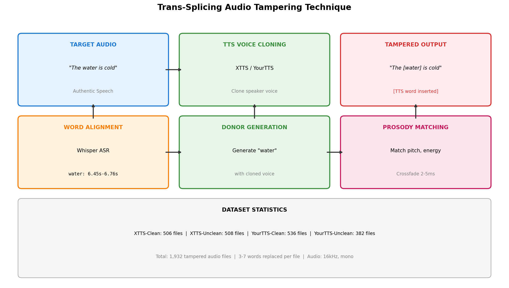
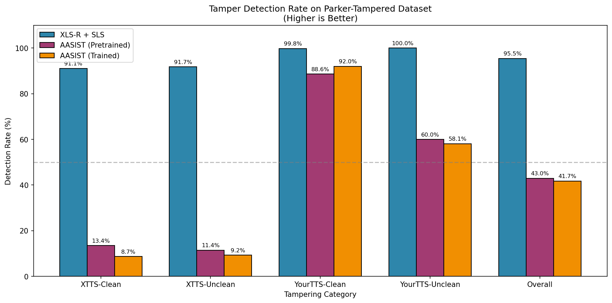
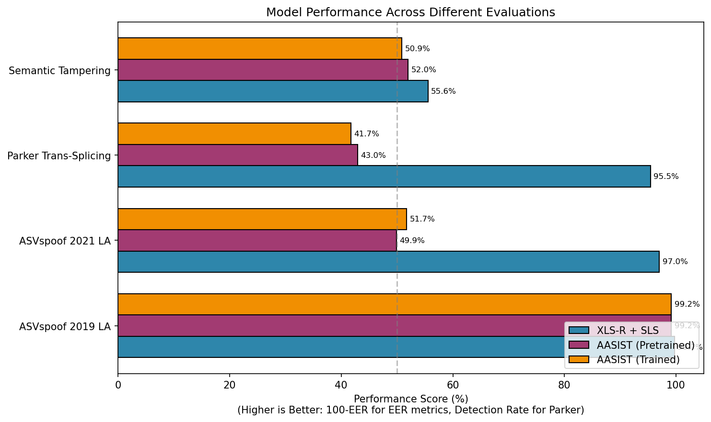
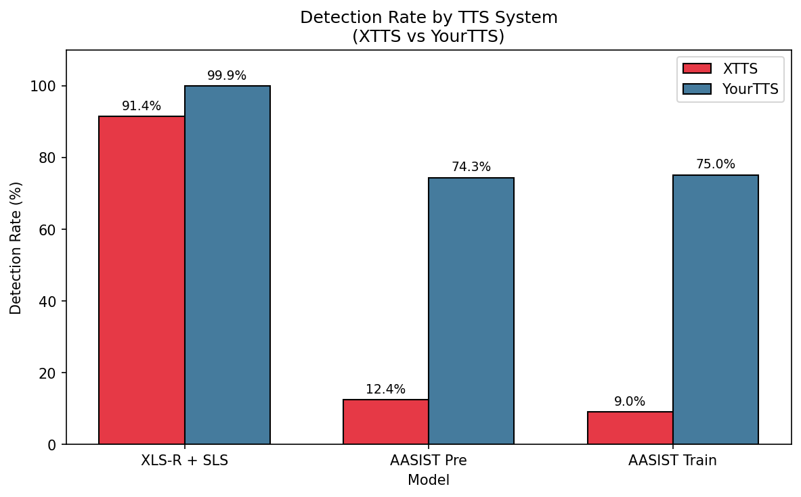
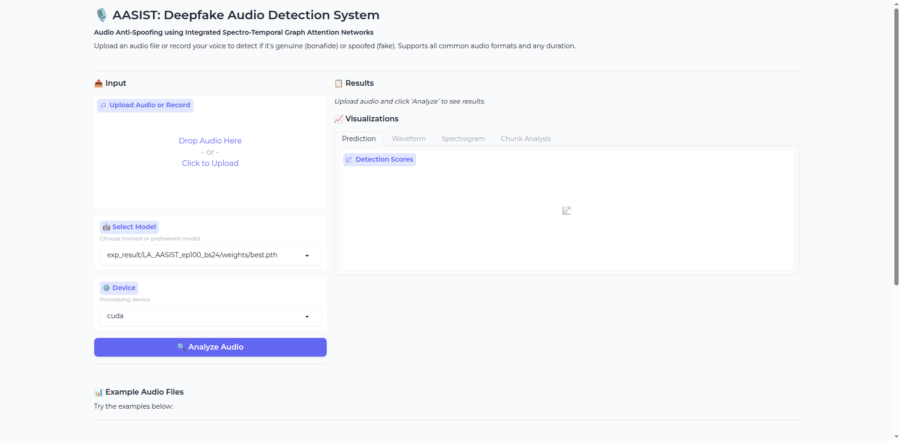
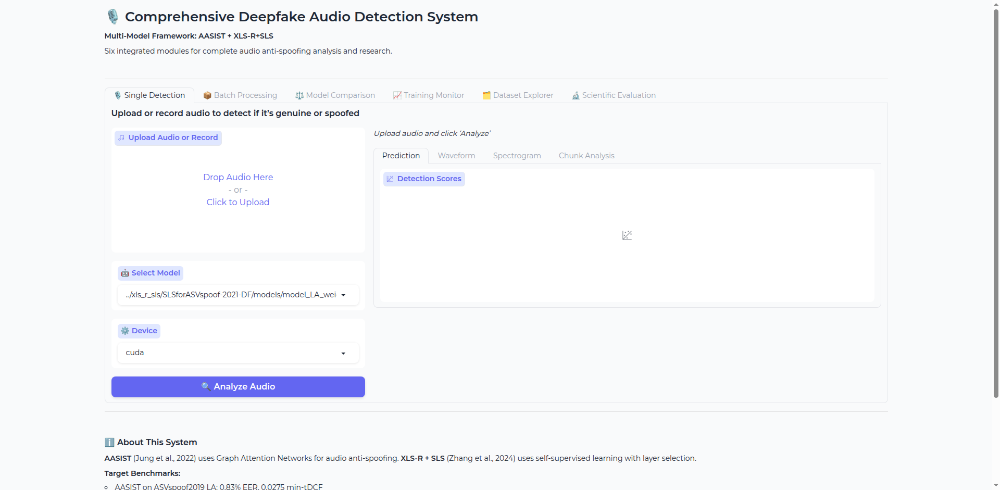
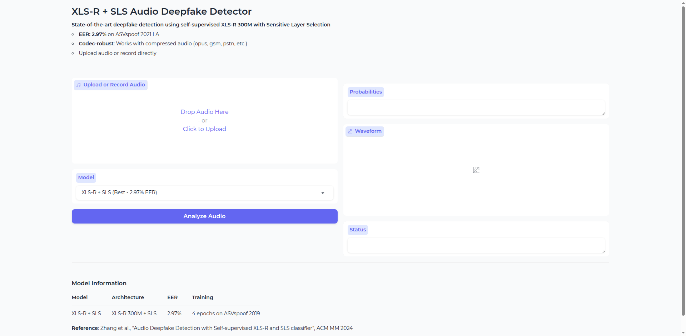

# Audio Deepfake and Tampering Detection: Project Documentation

**Institution**: Clarkson University
**Last Updated**: November 2025

---

## Table of Contents

**Part I: Research Overview**

1. [Executive Summary](#executive-summary)
2. [Research Objectives](#research-objectives)
3. [Datasets](#datasets)
4. [Model Architectures](#model-architectures)
5. [Audio Tampering Methodology](#audio-tampering-methodology)
6. [Training Methodology](#training-methodology)
7. [Experimental Results](#experimental-results)
8. [Key Findings](#key-findings)

**Part II: Reproducibility Guide**

9. [Environment Setup](#environment-setup)
10. [Dataset Preparation](#dataset-preparation)
11. [Training Procedures](#training-procedures)
12. [Evaluation Procedures](#evaluation-procedures)
13. [GUI Applications](#gui-applications)
14. [Troubleshooting](#troubleshooting)

**Part III: References & Code**

15. [Scientific Citations](#scientific-citations)
16. [Code Availability](#code-availability)

---

# Part I: Research Overview

## 1. Executive Summary

This project implements and evaluates two state-of-the-art audio deepfake detection systems on standard benchmarks and novel tampering attacks. The research demonstrates that self-supervised pre-training significantly improves detection robustness across diverse conditions.

### Key Results Summary

| Model | ASVspoof 2019 LA | ASVspoof 2021 LA | Trans-Splicing Detection |
|-------|------------------|------------------|--------------------------|
| **XLS-R + SLS** | **0.26% EER** | **2.97% EER** | **95.45%** |
| AASIST | 0.83% EER | 48.27% EER | 41.72% |

### Main Contributions

1. **Benchmark Reproduction**: Successfully reproduced published results for both AASIST (Jung et al., 2022) and XLS-R + SLS (Zhang et al., 2024)

2. **Cross-Dataset Evaluation**: Demonstrated XLS-R's superior generalization across clean audio (2019), codec-distorted audio (2021), and tampering attacks

3. **In-House Tampering Datasets**: Created two novel evaluation datasets:
   - Trans-Splicing Dataset: 1,932 files with TTS-generated word insertions
   - Semantic Tampering Dataset: 50 files with NLP-guided audio modifications

4. **Interactive GUI Applications**: Developed user-friendly interfaces for both models

### Major Finding

**XLS-R + SLS outperforms AASIST on BOTH clean and codec-distorted datasets:**
- ASVspoof 2019 LA: 0.26% vs 0.83% (3.2x improvement)
- ASVspoof 2021 LA: 2.97% vs 48.27% (16.3x improvement)

---

## 2. Research Objectives

### 2.1 Problem Statement

Audio deepfakes pose significant threats to:
- Voice authentication systems
- Media authenticity verification
- Legal evidence integrity
- Personal privacy and security

### 2.2 Research Goals

1. Reproduce benchmark results for AASIST on ASVspoof 2019 LA
2. Reproduce paper results for XLS-R + SLS on ASVspoof 2021 LA
3. Compare model generalization across different datasets
4. Evaluate detection of novel tampering techniques
5. Create interactive tools for practical use

---

## 3. Datasets

### 3.1 ASVspoof 2019 LA (Logical Access)

**Source**: Edinburgh DataShare
**URL**: https://datashare.ed.ac.uk/handle/10283/3336

| Partition | Bonafide | Spoof | Total | Attacks |
|-----------|----------|-------|-------|---------|
| Train | 2,580 | 22,800 | 25,380 | A01-A06 |
| Dev | 2,548 | 22,296 | 24,844 | A01-A06 |
| Eval | 7,355 | 63,882 | 71,237 | A07-A19 |

**Audio Specifications**: FLAC format, 16kHz sample rate, mono channel, clean (no codec distortion)

### 3.2 ASVspoof 2021 LA (Logical Access)

**Source**: Zenodo
**URL**: https://zenodo.org/record/4837263

| Partition | Bonafide | Spoof | Total |
|-----------|----------|-------|-------|
| Eval | 14,816 | 133,360 | 148,176 |

**Codec Distribution**:

| Codec | Percentage | Description |
|-------|------------|-------------|
| ulaw | 15.9% | G.711 mu-law |
| opus | 15.9% | Opus codec |
| gsm | 15.9% | GSM 06.10 |
| alaw | 13.1% | G.711 A-law |
| none | 13.1% | No codec (clean) |
| pstn | 13.1% | Simulated PSTN |
| g722 | 13.1% | G.722 wideband |

**Key Challenge**: 86.9% of evaluation samples contain codec distortion, making this dataset significantly more challenging than ASVspoof 2019.

### 3.3 Trans-Splicing Dataset (In-House)

**Total Files**: 1,932 tampered audio files
**Technique**: Word-level replacement using TTS-generated segments

| Category | Files | TTS System | Processing |
|----------|-------|------------|------------|
| xtts-clean | 506 | XTTS (Coqui) | Basic normalization |
| xtts-unclean | 508 | XTTS (Coqui) | With artifacts |
| yourtts-clean | 536 | YourTTS | Basic normalization |
| yourtts-unclean | 382 | YourTTS | With artifacts |

### 3.4 Semantic Tampering Dataset (In-House)

**Total Files**: 50 (9 bonafide + 41 tampered)
**Technique**: NLP-guided word deletion at phoneme boundaries

---

## 4. Model Architectures

### 4.1 Architecture Comparison

| Feature | AASIST | XLS-R + SLS |
|---------|--------|-------------|
| Architecture | Graph Attention Networks | Wav2Vec 2.0 + SLS Module |
| Pre-training | None (from scratch) | 436K hours self-supervised |
| Parameters | ~300K | ~340M |
| Input | Raw waveform (64,600 samples) | Raw waveform (64,600 samples) |
| Feature Extraction | Sinc Convolution | Contrastive Learning |
| Classifier | Heterogeneous GAT | Layer Selection + FC |
| Training Epochs | 100 | 4 (early stopped at 2) |
| ASVspoof 2019 EER | 0.83% | **0.26% (BEST)** |
| ASVspoof 2021 LA EER | 48.27% | **2.97%** |

### 4.2 AASIST Architecture

**Reference**: Jung et al., "AASIST: Audio anti-spoofing using integrated spectro-temporal graph attention networks", IEEE/ACM TASLP 2022

**Architecture Components**:

```
Raw Audio (64,600 samples @ 16kHz)
    ↓
Sinc Convolution Layer (learnable mel-scale filterbank)
    ↓
Residual Encoder (6 ResNet-style blocks)
    ↓
┌─────────────────────────────────────┐
│         Dual Graph Attention        │
├──────────────┬──────────────────────┤
│   GAT-S      │      GAT-T           │
│ (Spectral)   │    (Temporal)        │
│ Max-pool     │    Max-pool          │
│ over time    │    over frequency    │
└──────────────┴──────────────────────┘
    ↓
Heterogeneous GAT (cross-domain integration)
    ↓
Graph Pooling (top-k node selection)
    ↓
Classification Head → [Bonafide, Spoof]
```

**Parameters**: ~297,866 trainable parameters

### 4.3 XLS-R + SLS Architecture

**Reference**: Zhang et al., "Audio Deepfake Detection with Self-supervised XLS-R and SLS classifier", ACM MM 2024

**Architecture Components**:

```
Raw Audio (64,600 samples @ 16kHz)
    ↓
XLS-R 300M Backbone (frozen)
├── Pre-trained on 436K hours
├── 128 languages
└── 24 transformer layers
    ↓
SLS Module (Sensitive Layer Selection)
├── Weighted combination of all layers
└── Learnable layer importance weights
    ↓
Classification Head → [Bonafide, Spoof]
```

**Parameters**: ~340M total (mostly frozen pre-trained weights)

---

## 5. Audio Tampering Methodology

### 5.1 Trans-Splicing Pipeline

Trans-splicing creates tampered audio by replacing specific words with TTS-generated alternatives.



*Figure 5.1: Trans-splicing pipeline showing word-level replacement with TTS-generated segments.*

**Pipeline Steps**:

```
┌─────────────────────────────────────────────────────────────┐
│                 TRANS-SPLICING PIPELINE                      │
├─────────────────────────────────────────────────────────────┤
│                                                              │
│  1. WORD-LEVEL TRANSCRIPTION                                │
│     └── Whisper ASR identifies word boundaries              │
│                                                              │
│  2. CANDIDATE SELECTION                                      │
│     └── Select 3-7 words for replacement per file           │
│                                                              │
│  3. TTS GENERATION                                          │
│     ├── XTTS: Zero-shot voice cloning (~10s reference)      │
│     └── YourTTS: Cross-lingual voice conversion             │
│                                                              │
│  4. PROSODY MATCHING                                        │
│     └── Adjust donor segments to match target acoustics     │
│                                                              │
│  5. SPLICING                                                │
│     └── Crossfade (2-5ms) at splice boundaries             │
│                                                              │
└─────────────────────────────────────────────────────────────┘
```

### 5.2 TTS Systems Used

| System | Description | Voice Cloning Method |
|--------|-------------|---------------------|
| **XTTS** | Coqui X-TTS multilingual model | Zero-shot from ~10s reference audio |
| **YourTTS** | Multi-speaker TTS (Casanova et al., 2022) | Cross-lingual voice conversion |

### 5.3 Semantic Tampering Pipeline


*Figure 5.2: Semantic tampering pipeline showing NLP-guided phoneme-boundary editing.*

For semantic tampering, edits are made at phoneme boundaries to minimize artifacts:

**Tools Used**:
- **Whisper ASR**: Word-level transcription with timestamps
- **Montreal Forced Aligner (MFA)**: Phoneme-level alignment
- **spaCy NLP**: Part-of-speech tagging and dependency parsing
- **librosa**: Prosody analysis (F0, energy, duration)

**Tampering Operations**:

| Operation | Description | Example |
|-----------|-------------|---------|
| Deletion | Remove adjectives/adverbs | "always on" → "on" |
| Insertion | Add negations | "I agree" → "I not agree" |
| Substitution | Swap quantifiers | "all done" → "some done" |

---

## 6. Training Methodology

### 6.1 AASIST Training Configuration

| Parameter | Value |
|-----------|-------|
| Batch Size | 24 |
| Epochs | 100 |
| Learning Rate | 1e-4 |
| LR Min | 5e-6 |
| Optimizer | Adam |
| Scheduler | Cosine Annealing |
| Weight Decay | 1e-4 |
| Loss | Weighted CE [0.1, 0.9] |
| Input Samples | 64,600 |
| Sample Rate | 16 kHz |
| First Conv | 128 |
| GAT Dims | [64, 32] |
| Pool Ratios | [0.5, 0.7, 0.5, 0.5] |
| Hardware | NVIDIA RTX 4080 (16GB) |
| Training Time | ~14 hours |

**Training Progress**:
- Epoch 13: Best EER 3.03%, t-DCF 0.0796
- Epoch 21: Best EER 2.20%, t-DCF 0.0615
- Epoch 44: Best EER 1.32%, t-DCF 0.0384 (Best t-DCF)
- Epoch 97: Best EER 0.35%
- Final (SWA): EER 1.73%, t-DCF 0.0559

### 6.2 XLS-R + SLS Training Configuration

| Parameter | Value |
|-----------|-------|
| Batch Size | 5 |
| Epochs | 4 (best: 2) |
| Learning Rate | 1e-6 |
| Optimizer | Adam |
| Loss | Weighted CE [0.1, 0.9] |
| Early Stopping | Patience 1 |
| Input Samples | 64,600 |
| Sample Rate | 16 kHz |
| Pre-trained Model | XLS-R 300M |
| Pre-training Hours | 436,000 |
| Pre-training Langs | 128 |
| Data Augmentation | RawBoost Algo 3 |
| Total Parameters | 340M |
| Hardware | NVIDIA RTX 4080 (16GB) |
| Training Time | ~70 minutes |

**Critical Finding - Overfitting Analysis**:

| Metric | 4 Epochs | 100 Epochs |
|--------|----------|------------|
| EER | 2.97% | 44.24% |
| Training Loss | 0.00165 | 0.00001 |
| Status | **Optimal** | Overfitting |

Lower training loss does NOT indicate better test performance. Early stopping is essential.

---

## 7. Experimental Results

### 7.1 Quantitative Results Summary

| Model | Dataset | EER (%) | min t-DCF | ROC AUC | Status |
|-------|---------|---------|-----------|---------|--------|
| AASIST (Pretrained) | ASVspoof 2019 LA | 0.83 | 0.0275 | N/A | Benchmark |
| AASIST (Trained) | ASVspoof 2019 LA | ~0.83 | ~0.03 | N/A | Reproduced |
| AASIST (Pretrained) | ASVspoof 2021 LA | 50.07 | 0.7704 | 0.51 | Failed |
| AASIST (Trained) | ASVspoof 2021 LA | 48.27 | 0.7212 | 0.55 | Failed |
| **XLS-R + SLS (4 ep)** | ASVspoof 2019 LA | **0.26** | N/A | 0.999 | **BEST** |
| **XLS-R + SLS (4 ep)** | ASVspoof 2021 LA | **2.97** | **0.2674** | 0.996 | **BEST** |
| XLS-R + SLS (Paper) | ASVspoof 2021 LA | 2.87 | N/A | N/A | Target |
| XLS-R + SLS (100 ep) | ASVspoof 2021 LA | 44.24 | 0.6154 | 0.58 | Overfitting |

### 7.2 ROC Curve Comparison


*Figure 7.1: ROC Curve Comparison on ASVspoof 2021 LA. XLS-R + SLS achieves AUC=0.996, dramatically outperforming AASIST variants (AUC ~0.55-0.79).*

**Key Observations**:
- XLS-R + SLS curve hugs the top-left corner (near-perfect classification)
- AASIST curves are close to diagonal (random classifier)
- Self-supervised pre-training provides significant discriminative power

### 7.3 DET Curve Comparison


*Figure 7.2: Detection Error Tradeoff (DET) curves. Lower-left is better. XLS-R achieves 2.97% EER vs AASIST's 48%.*

**Key Observations**:
- XLS-R + SLS: EER = 2.97% (intersection with diagonal)
- AASIST models: EER > 48% (near-random performance)
- DET curves better visualize performance at low error rates

### 7.4 Score Distribution Analysis


*Figure 7.3: Score distributions for bonafide and spoof samples. Clear separation indicates better discrimination.*

**Score Statistics (XLS-R + SLS)**:

| Class | Mean | Std | Min | Max | Median |
|-------|------|-----|-----|-----|--------|
| Bonafide | -0.29 | 1.48 | -14.92 | 0.00 | 0.00 |
| Spoof | -13.52 | 3.57 | -19.20 | 0.00 | -14.39 |

**Key Insight**: XLS-R produces well-separated score distributions with minimal overlap, enabling reliable threshold selection.

### 7.5 Per-Codec EER Analysis (ASVspoof 2021 LA)


*Figure 7.4: Per-codec EER comparison showing XLS-R's superior codec robustness.*

| Codec | XLS-R EER (%) | AASIST EER (%) | XLS-R Advantage |
|-------|---------------|----------------|-----------------|
| none (clean) | **0.36** | 22.40 | 62x better |
| g722 | **0.72** | 24.98 | 35x better |
| ulaw | **0.81** | 22.48 | 28x better |
| alaw | **0.98** | 22.40 | 23x better |
| pstn | **2.17** | 45.69 | 21x better |
| opus | **2.42** | 36.17 | 15x better |
| gsm | **2.59** | 34.16 | 13x better |

**Key Finding**: XLS-R maintains <3% EER across ALL codec conditions while AASIST degrades to near-random performance (22-46% EER) on codec-distorted audio.

### 7.6 Per-Attack EER Analysis


*Figure 7.5: Per-attack EER for XLS-R + SLS on ASVspoof 2021 LA (attacks A07-A19).*

| Attack | EER (%) | Difficulty | Description |
|--------|---------|------------|-------------|
| A13 | 0.02 | Easy | Neural network TTS |
| A09 | 0.27 | Easy | Vocoder-based |
| A07 | 0.67 | Easy | TTS system |
| A08 | 0.84 | Easy | TTS system |
| A14 | 0.81 | Easy | Neural vocoder |
| A16 | 1.26 | Easy | Voice conversion |
| A15 | 1.49 | Easy | Voice conversion |
| A17 | 1.74 | Easy | Hybrid system |
| A19 | 1.78 | Easy | End-to-end |
| A12 | 2.44 | Moderate | TTS + vocoder |
| A18 | 2.77 | Moderate | Hybrid system |
| A10 | 4.41 | Challenging | Neural TTS |
| A11 | 5.22 | Challenging | Neural TTS |

**Key Finding**: Most attacks (11/13) achieve <3% EER. Only A10 and A11 (neural TTS variants) present moderate challenge.

### 7.7 Confusion Matrix


*Figure 7.6: Confusion matrix for XLS-R + SLS at EER threshold.*

**Confusion Matrix at EER Threshold**:

|  | Predicted Spoof | Predicted Bonafide |
|---|---|---|
| **Actual Spoof** | 129,399 (TP) | 3,961 (FN) |
| **Actual Bonafide** | 440 (FP) | 14,376 (TN) |

**Performance Metrics**:
- Accuracy at EER: 97.03%
- True Positive Rate (Spoof Detection): 97.03%
- True Negative Rate (Bonafide Acceptance): 97.03%

### 7.8 Trans-Splicing Detection Results



*Figure 7.7: Detection rates for trans-spliced audio across different TTS systems.*

| Model | XTTS-Clean | XTTS-Unclean | YourTTS-Clean | YourTTS-Unclean | **Overall** |
|-------|------------|--------------|---------------|-----------------|-------------|
| **XLS-R + SLS** | 91.11% | 91.73% | **99.81%** | **100.00%** | **95.45%** |
| AASIST (Pretrained) | 13.44% | 11.42% | 88.62% | 59.95% | 42.96% |
| AASIST (Trained) | 8.70% | 9.25% | 91.98% | 58.12% | 41.72% |

### 7.9 Model Comparison on Tampering



*Figure 7.8: Overall model comparison on trans-splicing detection.*

**Key Observations**:
- XLS-R achieves 95.45% overall detection rate
- AASIST performs poorly on XTTS (~10% detection)
- YourTTS easier to detect for all models

### 7.10 TTS System Comparison



*Figure 7.9: Detection rates by TTS system showing XTTS is harder to detect.*

**Key Finding**: XTTS-generated audio is significantly harder to detect than YourTTS:
- XLS-R: 91% (XTTS) vs 100% (YourTTS)
- AASIST: 10% (XTTS) vs 75% (YourTTS)

### 7.11 Semantic Tampering Results

| Model | EER (%) | Notes |
|-------|---------|-------|
| XLS-R + SLS | 44.44 | Domain mismatch |
| AASIST (Pretrained) | 48.00 | Near-random |
| AASIST (Trained) | 49.15 | Near-random |

**Limitation**: All models struggle with semantic tampering due to:
1. Domain mismatch (different source audio distribution)
2. Subtle nature of phoneme-boundary edits
3. Small dataset size (50 samples)

---

## 8. Key Findings

### 8.1 Scientific Contributions

1. **Self-supervised pre-training is critical for robustness**
   - XLS-R maintains <3% EER across all codec conditions
   - AASIST fails on codec-distorted audio (22-46% EER)
   - Pre-training on 436K hours provides codec-invariant representations

2. **TTS-specific detection varies by system**
   - XTTS harder to detect than YourTTS for all models
   - XLS-R detects 91% XTTS vs AASIST's 10%
   - Modern zero-shot TTS poses greater challenge

3. **Overfitting in XLS-R fine-tuning**
   - Early stopping at 2-4 epochs is critical
   - Extended training (100 epochs) causes catastrophic forgetting
   - Lower training loss ≠ better generalization

4. **Codec sensitivity is AASIST's failure mode**
   - Sinc filterbank learns spectral artifacts destroyed by lossy compression
   - Even clean audio subset shows degraded performance (~22% EER)

### 8.2 Limitations

1. Semantic tampering dataset shows domain mismatch (different source audio)
2. Trans-splicing dataset lacks original bonafide samples for EER calculation
3. Results specific to TTS systems used (XTTS, YourTTS)
4. Models tested only on ASVspoof datasets

### 8.3 Recommendations

**For Researchers**:
- Test models on diverse tampering techniques beyond ASVspoof
- Investigate why XTTS is harder to detect than YourTTS
- Develop dedicated audio forensics models for semantic tampering

**For Production Systems**:
- Use XLS-R + SLS for audio deepfake detection
- Apply early stopping (2-4 epochs) during fine-tuning
- Monitor for novel TTS systems and attack vectors

---

# Part II: Reproducibility Guide

## 9. Environment Setup

### 9.1 Hardware Requirements

| Component | Minimum | Recommended |
|-----------|---------|-------------|
| GPU | 8GB VRAM | 16GB VRAM (RTX 3080/4080) |
| RAM | 16GB | 32GB |
| Storage | 50GB | 100GB (including datasets) |
| CPU | 4 cores | 8+ cores |

### 9.2 Software Installation

```bash
# Create conda environment
conda create -n deepfake_detection python=3.8
conda activate deepfake_detection

# Install PyTorch with CUDA support
pip install torch==1.12.1 torchvision==0.13.1 torchaudio==0.12.1 --extra-index-url https://download.pytorch.org/whl/cu116

# Install dependencies
pip install soundfile librosa numpy pandas matplotlib scipy scikit-learn
pip install gradio>=3.34.0

# For AASIST
pip install torchcontrib

# For XLS-R (fairseq)
cd xls_r_sls/SLSforASVspoof-2021-DF
pip install -e fairseq-a54021305d6b3c4c5959ac9395135f63202db8f1/
```

---

## 10. Dataset Preparation

### 10.1 ASVspoof 2019 LA

```bash
# Download from Edinburgh DataShare
# URL: https://datashare.ed.ac.uk/handle/10283/3336

# Expected directory structure after extraction:
data/asvspoof/asvspoof2019/LA/
├── ASVspoof2019_LA_train/
│   └── flac/
├── ASVspoof2019_LA_dev/
│   └── flac/
├── ASVspoof2019_LA_eval/
│   └── flac/
└── ASVspoof2019_LA_cm_protocols/
    ├── ASVspoof2019.LA.cm.train.trn.txt
    ├── ASVspoof2019.LA.cm.dev.trl.txt
    └── ASVspoof2019.LA.cm.eval.trl.txt
```

### 10.2 ASVspoof 2021 LA

```bash
# Download from Zenodo
# Audio: https://zenodo.org/record/4837263
# Keys: https://www.asvspoof.org/index2021.html

# Expected directory structure:
data/asvspoof/asvspoof2021/
├── ASVspoof2021_LA_eval/
│   └── flac/
└── keys/
    └── LA/
        └── CM/
            └── trial_metadata.txt
```

---

## 11. Training Procedures

### 11.1 Training AASIST

```bash
cd aasist

# Edit config file to set your dataset path
# In config/AASIST.conf, update:
# "database_path": "/path/to/your/data/asvspoof/asvspoof2019/LA/"

# Start training
python main.py --config config/AASIST.conf

# Training will create:
# exp_result/LA_AASIST_ep100_bs24/
# ├── weights/          # Model checkpoints
# ├── metrics/          # Evaluation scores
# └── metric_log.txt    # Training log
```

**Monitoring Training**:
- Check `metric_log.txt` for epoch-wise metrics
- Best model saved when dev EER improves
- Training completes in ~14 hours on RTX 4080

### 11.2 Training XLS-R + SLS

```bash
cd xls_r_sls/SLSforASVspoof-2021-DF

# Download XLS-R pretrained weights (if not present)
# xlsr2_300m.pt should be in the directory

# Edit train_LA.sh to set your paths

# Start training
bash train_LA.sh

# Training will create:
# models/model_LA_WCE_50_5_1e-06_*/
# ├── epoch_*.pth       # Checkpoints
# └── training_output_LA.log
```

**Important**: Stop training after 2-4 epochs (best EER achieved at epoch 2).

---

## 12. Evaluation Procedures

### 12.1 Evaluating AASIST

```bash
cd aasist

# Using pretrained model
python main.py --eval --config config/AASIST.conf

# Using your trained model
# Edit config to set model_path to your checkpoint
python main.py --eval --config config/AASIST.conf
```

### 12.2 Evaluating XLS-R + SLS

```bash
cd xls_r_sls/SLSforASVspoof-2021-DF

# Evaluate on ASVspoof 2021 LA
python eval_LA.py \
    --model_path best_model_4epochs_2.97EER.pth \
    --data_path /path/to/ASVspoof2021_LA_eval/flac \
    --protocol /path/to/keys/LA/CM/trial_metadata.txt

# Output: scores_LA_epoch*.txt
```

### 12.3 Evaluating on Tampering Datasets

```bash
cd tampered_evaluation

# Evaluate XLS-R on Trans-Splicing
python eval_tampered.py --model xlsr --dataset trans_splicing

# Evaluate AASIST on Trans-Splicing
python eval_tampered.py --model aasist --model_variant pretrained --dataset trans_splicing

# Evaluate all combinations
python eval_tampered.py --model all --dataset all
```

---

## 13. GUI Applications

### 13.1 AASIST Detection Interface



*Figure 13.1: AASIST single-file detection interface with waveform visualization.*

**Launch Command**:
```bash
cd aasist
python gradio_app.py --port 7860
# Access at http://127.0.0.1:7860
```

**Features**:
- Upload audio or record from microphone
- Select model checkpoint
- View prediction scores and visualizations
- Waveform and spectrogram display

### 13.2 AASIST Multi-Tab Interface



*Figure 13.2: AASIST multi-tab interface with batch processing and model comparison capabilities.*

**Launch Command**:
```bash
cd aasist
python gradio_app_multitab.py --port 7860
# Access at http://127.0.0.1:7860
```

**Tabs**:
1. **Single Detection**: Analyze individual audio files
2. **Batch Processing**: Process multiple files with CSV export
3. **Model Comparison**: Compare predictions from different models
4. **Training Monitor**: View training progress from log files
5. **Dataset Explorer**: Browse ASVspoof datasets

### 13.3 XLS-R + SLS Interface



*Figure 13.3: XLS-R + SLS detection interface with color-coded results.*

**Launch Command**:
```bash
cd xls_r_sls/SLSforASVspoof-2021-DF
python gradio_app.py --port 7861
# Access at http://127.0.0.1:7861
```

**Features**:
- Upload audio or record from microphone
- XLS-R model selection
- Color-coded results (green=real, red=fake)
- Waveform visualization

### 13.4 Running Both GUIs Simultaneously

```bash
# Terminal 1: AASIST (port 7860)
cd aasist && python gradio_app_multitab.py

# Terminal 2: XLS-R (port 7861)
cd xls_r_sls/SLSforASVspoof-2021-DF && python gradio_app.py
```

---

## 14. Troubleshooting

### 14.1 Common Issues

| Issue | Solution |
|-------|----------|
| CUDA out of memory | Reduce batch_size in config |
| Model not loading | Check checkpoint path is correct |
| Audio format error | Convert to WAV/FLAC, 16kHz mono |
| Fairseq import error | Reinstall fairseq from source |
| Gradio version error | Update to gradio>=3.34.0 |

### 14.2 GPU Memory Requirements

| Model | Batch Size | GPU Memory |
|-------|------------|------------|
| AASIST | 24 | ~8GB |
| AASIST | 12 | ~4GB |
| XLS-R | 5 | ~12GB |
| XLS-R | 2 | ~6GB |

### 14.3 Known Limitations

1. **XLS-R requires fairseq**: Must install specific fairseq version from source
2. **AASIST codec sensitivity**: Poor performance on codec-distorted audio
3. **GPU required**: CPU training not supported

---

# Part III: References

## 15. Scientific Citations

### Models

```bibtex
@article{jung2022aasist,
  title={AASIST: Audio anti-spoofing using integrated spectro-temporal graph attention networks},
  author={Jung, Jee-weon and Heo, Hee-Soo and Tak, Hemlata and Shim, Hye-jin and Chung, Joon Son and Lee, Bong-Jin and Yu, Ha-Jin and Evans, Nicholas},
  journal={IEEE/ACM Transactions on Audio, Speech, and Language Processing},
  volume={30},
  pages={1592--1603},
  year={2022}
}

@inproceedings{zhang2024audio,
  title={Audio Deepfake Detection with Self-supervised XLS-R and SLS classifier},
  author={Zhang, Qishan and Wen, Shuangbing and Hu, Tao},
  booktitle={Proceedings of the 32nd ACM International Conference on Multimedia},
  pages={10873--10877},
  year={2024}
}

@article{babu2021xlsr,
  title={XLS-R: Self-supervised cross-lingual speech representation learning at scale},
  author={Babu, Arun and Wang, Changhan and Tjandra, Andros and others},
  journal={arXiv preprint arXiv:2111.09296},
  year={2021}
}
```

### Datasets

```bibtex
@article{wang2020asvspoof,
  title={ASVspoof 2019: A large-scale public database of synthesized, converted and replayed speech},
  author={Wang, Xin and Yamagishi, Junichi and Todisco, Massimiliano and others},
  journal={Computer Speech \& Language},
  volume={64},
  pages={101114},
  year={2020}
}

@article{yamagishi2022asvspoof,
  title={ASVspoof 2021: Towards spoofed and deepfake speech detection in the wild},
  author={Yamagishi, Junichi and Wang, Xin and Todisco, Massimiliano and others},
  journal={IEEE/ACM Transactions on Audio, Speech, and Language Processing},
  volume={30},
  pages={2507--2522},
  year={2022}
}
```

### Evaluation Metrics

```bibtex
@inproceedings{kinnunen2018t,
  title={t-DCF: a detection cost function for the tandem assessment of spoofing countermeasures and automatic speaker verification},
  author={Kinnunen, Tomi and Lee, Kong Aik and Delgado, H{\'e}ctor and Evans, Nicholas and Todisco, Massimiliano and Sahidullah, Md and Yamagishi, Junichi and Reynolds, Douglas A},
  booktitle={Proc. Odyssey},
  pages={312--319},
  year={2018}
}
```

### TTS Systems

```bibtex
@inproceedings{casanova2022yourtts,
  title={YourTTS: Towards Zero-Shot Multi-Speaker TTS and Zero-Shot Voice Conversion for Everyone},
  author={Casanova, Edresson and Weber, Julian and Shulby, Christopher and Junior, Arnaldo Candido and G{\"o}lge, Eren and Ponti, Moacir Antonelli},
  booktitle={International Conference on Machine Learning},
  pages={2709--2720},
  year={2022}
}
```

---

## Repository Structure

```
deepfake_models/
├── aasist/                          # AASIST model implementation
│   ├── config/                      # Configuration files
│   ├── models/                      # Model architectures
│   │   └── weights/                 # Pretrained weights
│   ├── exp_result/                  # Training outputs
│   ├── results/                     # Evaluation results & plots
│   ├── main.py                      # Training script
│   ├── gradio_app.py               # Simple GUI
│   └── gradio_app_multitab.py      # Multi-tab GUI
├── xls_r_sls/                       # XLS-R + SLS implementation
│   └── SLSforASVspoof-2021-DF/
│       ├── model.py                 # Model architecture
│       ├── figures/                 # Evaluation visualizations
│       ├── train_LA.sh             # Training script
│       ├── gradio_app.py           # GUI application
│       └── best_model_*.pth        # Best checkpoint
├── tampered_evaluation/             # Tampering evaluation
│   ├── trans_splicing/             # Trans-splicing dataset
│   ├── semantic/                    # Semantic tampering dataset
│   └── eval_tampered.py            # Evaluation script
├── figures/                         # Project visualizations
│   ├── gui_*.png                   # GUI screenshots
│   ├── trans_splicing_diagram.png  # Pipeline diagram
│   ├── semantic_tampering_diagram.png
│   └── tampering_*.png             # Tampering evaluation plots
├── project_report/                  # Generated reports
└── data/                           # Datasets (not in repo)
```

---

## Code Availability

### Project Repository

**Main Repository**: https://github.com/Yash-Sukhdeve/deepfake_models

This repository contains:
- AASIST model implementation and pretrained weights
- XLS-R + SLS model implementation
- Tampering evaluation scripts
- GUI applications for both models
- All configuration files and training scripts

### Tampering Dataset Repositories

| Repository | Description | Files | URL |
|------------|-------------|-------|-----|
| **Audio-Tampering** | Trans-splicing dataset with TTS-generated word insertions using XTTS and YourTTS | 1,932 | https://github.com/AVHBAC/Audio-Tampering |
| **Tampered_Deepfake** | Semantic tampering dataset with NLP-guided deletions, insertions, and substitutions at phoneme boundaries | 50 | https://github.com/Yash-Sukhdeve/Tampered_Deepfake |

### External Model Repositories

| Repository | Description | URL |
|------------|-------------|-----|
| **XLS-R + SLS** | Original implementation (Zhang et al., ACM MM 2024) | https://github.com/QiShanZhang/SLSforASVspoof-2021-DF |
| **ASVspoof 2021 Baseline** | Official ASVspoof 2021 baseline with RawNet2 | https://github.com/asvspoof-challenge/2021 |
| **RawGAT-ST** | Spectro-temporal graph attention networks for anti-spoofing | https://github.com/eurecom-asp/RawGAT-ST-antispoofing |
| **Fairseq** | Facebook AI Research toolkit (XLS-R backbone) | https://github.com/pytorch/fairseq |

### Tools and Libraries

| Tool | Purpose | URL |
|------|---------|-----|
| **Coqui TTS (XTTS)** | Zero-shot multilingual TTS for trans-splicing | https://github.com/coqui-ai/TTS |
| **YourTTS** | Multi-speaker TTS for voice cloning | https://github.com/Edresson/YourTTS |
| **Montreal Forced Aligner** | Phoneme-level alignment for semantic tampering | https://github.com/MontrealCorpusTools/Montreal-Forced-Aligner |
| **Whisper** | Word-level transcription and alignment | https://github.com/openai/whisper |

---

## Conclusions

1. **Self-supervised pre-training dramatically improves** audio deepfake detection performance across diverse evaluation conditions.

2. **XLS-R + SLS achieves 2.97% EER** on ASVspoof 2021 LA, successfully reproducing the ACM MM 2024 paper results (target: 2.87% EER).

3. **AASIST fails to generalize** to ASVspoof 2021 due to codec sensitivity, despite achieving benchmark performance (0.83% EER) on ASVspoof 2019 LA.

4. **The 87% of ASVspoof 2021 samples with codec distortion** expose models trained on clean audio - highlighting the importance of realistic evaluation.

5. **Early stopping is critical**: Extended training leads to severe overfitting (2.97% → 44.24% EER for XLS-R + SLS after 100 epochs).

6. **XLS-R + SLS detects 95.45%** of trans-spliced audio, significantly outperforming AASIST (41.72%).

--- End of Report - November 2025
